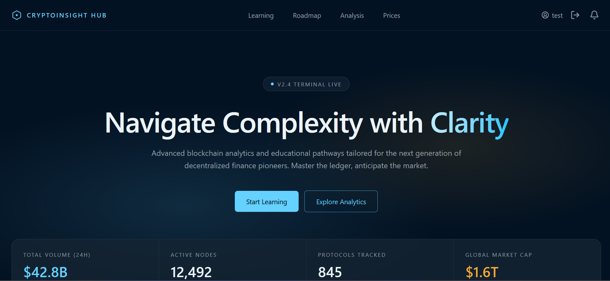
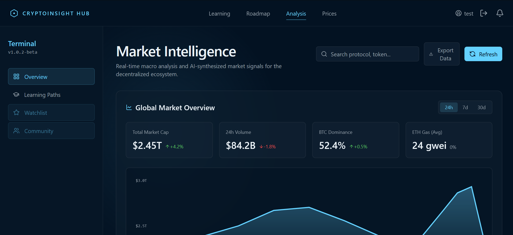
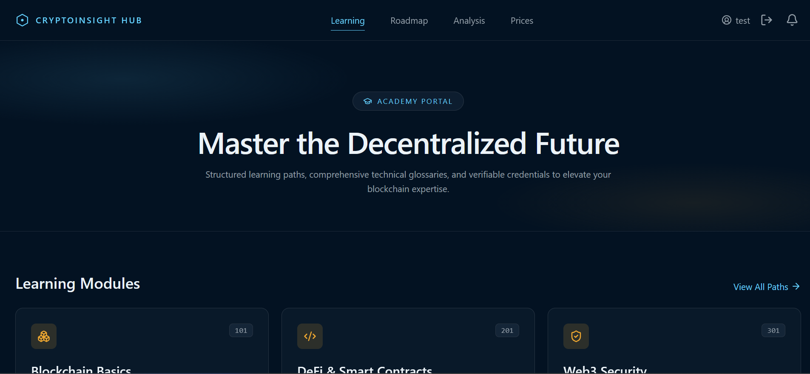
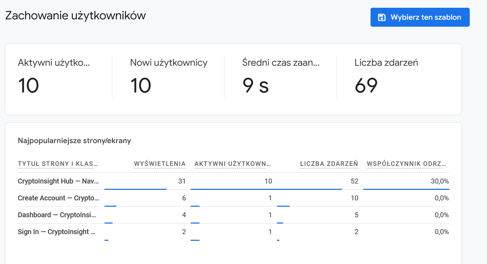
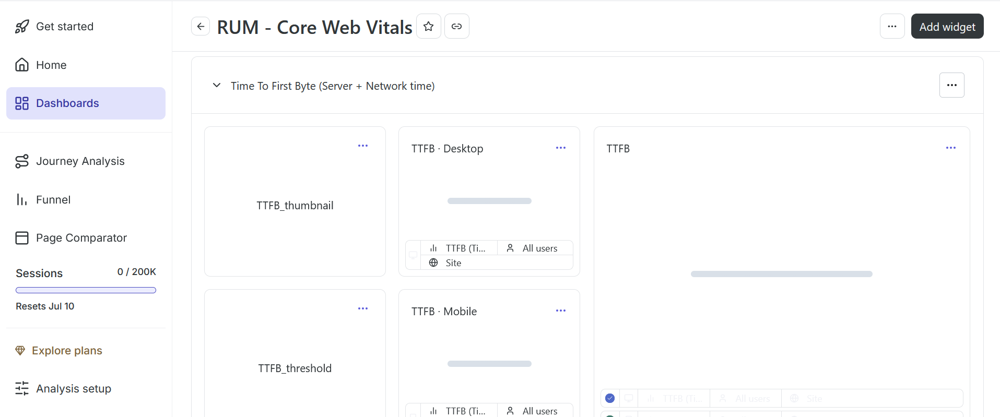

# 📈 Crypto Insight Hub

Crypto Insight Hub to kompleksowa platforma internetowa stworzona dla entuzjastów kryptowalut. Aplikacja umożliwia śledzenie cen na żywo, przeprowadzanie zaawansowanej analizy rynkowej, zarządzanie własnym portfolio (Dashboard) oraz zdobywanie nowej wiedzy za pomocą modułu edukacyjnego.

## ✨ Główne funkcje

- **Dashboard:** Spersonalizowany panel użytkownika do śledzenia ulubionych kryptowalut.
- **Analiza rynkowa (Analysis):** Zaawansowane dane i wykresy ułatwiające podejmowanie decyzji inwestycyjnych.
- **Ceny na żywo (Prices):** Bieżące notowania najważniejszych kryptowalut na rynku.
- **Moduł edukacyjny (Learning):** Materiały pomocne we wprowadzaniu nowych użytkowników w świat krypto.
- **Autoryzacja użytkowników:** Bezpieczne logowanie i rejestracja (wspierane przez Firebase/JWT).

---

## 📸 Zrzuty ekranu

### 💻 Wygląd aplikacji

Tutaj znajduje się podgląd głównych widoków naszej platformy.


*Strona główna strony, prezentująca przegląd rynku i statystyki.*


*Widok szczegółowej analizy wybranej kryptowaluty z wykresami.*


*Moduł nauki (Learning) ułatwiający wejście w świat technologii blockchain.*

### 📊 Analityka (Google Analytics)

Monitorujemy ruch na stronie i zaangażowanie użytkowników, aby stale ulepszać platformę.


*Raport przedstawiający liczbę aktywnych użytkowników.*

### 🔥 Zachowania Użytkowników (Hotjar)

Wykorzystujemy narzędzie Hotjar, aby optymalizować UX/UI na podstawie map cieplnych oraz nagrań sesji.


*Strona Core Web Vitals prezentująca informacje związane z technicznymi szczegółami dostępu do strony, na przykład czasu oczekiwania na odpowiedź aplikacji.*

---

## 🛠️ Technologie

Projekt został zbudowany z wykorzystaniem nowoczesnego stosu technologicznego:

**Frontend:**
- [React.js](https://reactjs.org/) + [Vite](https://vitejs.dev/)
- [TypeScript](https://www.typescriptlang.org/)
- [Tailwind CSS](https://tailwindcss.com/)
- [shadcn/ui](https://ui.shadcn.com/) (komponenty interfejsu)

**Backend:**
- Node.js & Express (katalog `/server`)
- Firebase (Autoryzacja / DB)
- JWT (Bezpieczeństwo)

---

## 🚀 Uruchomienie projektu lokalnie

### Wymagania
- Node.js (wersja 16.x lub nowsza)
- npm, yarn lub pnpm


### 1. Klonowanie repozytorium
```bash
git clone https://github.com/VelesW/CryptoInsightHub.git
cd cryptoinsighthub
```
### 2. Konfiguracja Frontendu
```bash
# Instalacja zależności
npm install

# Uruchomienie serwera deweloperskiego (Vite)
npm run dev
```
Aplikacja frontendowa będzie dostępna pod adresem: http://localhost:5173

### 3. Konfiguracja Backendu (Serwera)
Otwórz nową kartę w terminalu i przejdź do folderu serwera:
```bash
cd server

# Skopiuj plik z przykładowymi zmiennymi środowiskowymi
cp .env.example .env
# Pamiętaj, aby uzupełnić plik .env swoimi kluczami!

# Instalacja zależności
npm install

# Uruchomienie serwera backendowego
npm run dev
```

## 📂 Struktura katalogów
```bash
CryptoInsightHub/
├── public/               # Statyczne zasoby (ikony, favicon)
├── src/                  # Kod źródłowy Frontendu
│   ├── assets/           # Obrazki i grafiki
│   ├── components/       # Komponenty UI wielokrotnego użytku (UI, Site, Auth)
│   ├── context/          # React Context (np. AuthContext)
│   ├── hooks/            # Własne hooki React (np. use-mobile)
│   ├── lib/              # Funkcje pomocnicze, konfiguracja API i Firebase
│   └── pages/            # Widoki aplikacji (Dashboard, Analysis, Prices, Login, itp.)
├── server/               # Kod źródłowy Backendu (Node.js/Express)
│   ├── src/              # Kod serwera, middleware, trasy logowania
│   └── .env.example      # Przykładowe zmienne środowiskowe serwera
├── package.json          # Zależności projektu frontendowego
└── tailwind.config.cjs   # Konfiguracja Tailwind CSS
```
## 📄 Licencja

Ten projekt udostępniany jest na warunkach licencji określonej w pliku LICENSE.